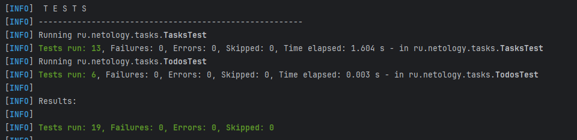

# Программа-планировщик с системой задач разных видов

_Цель:_ реализация системы классов задач с использованием **наследования и переопределения методов**; применение ранее изученных возможностей Java: массивы, инкапсуляция полей, конструкторы; проверка программы юнит-тестами

# Входные данные

- необходимо реализовать 3 вида задач: 1) простая задача SimpleTask с id, title; 2) сложная задача Epic с id и массивом текстовых подзадач; 3) задача Meeting с описанием встреч параметрами id, topic, project, start
- дан пример родительского класса Task, от которого необходимо отнаследовать другие виды задач
- дан менеджер Todos для управления задачами с методом добавления задач и тестом на данный метод
- дан метод поиска задач по поисковому запросу matches для Task, который необходимо переопределить в каждом наследнике (есть пример реализации метода для Meeting)
- дан пример реализации метода поиска search для менеджера Todos

# Выходные данные

- реализованы классы SimpleTask, Epic, Meeting, являющиеся наследниками класса Task
- переопределен метод matches для SimpleTask, Epic
- написаны и проведены тесты на метод matches для классов SimpleTask, Epic, Meeting
- написаны и проведены тесты на метод search для менеджера Todos
- тесты прошли без ошибок
- успешная сборка

mvn clean verify

